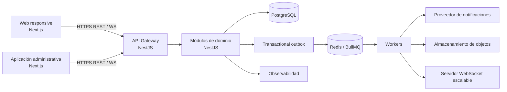

# Arquitectura de la plataforma de beneficios

## Alcance de esta decisión

Este documento define la arquitectura objetivo de una plataforma SaaS de beneficios para Argentina. Es una base de producción: no contempla datos semilla, cuentas de demostración, comercios ficticios ni contenido de prueba. La base de datos iniciará vacía; categorías, comercios, usuarios, beneficios y configuración serán creados por personas autorizadas desde la plataforma.

La siguiente etapa será configurar el proyecto conforme a este diseño. No se crearán aplicaciones ni infraestructura antes de cerrar estas decisiones.

## Principios

- **Monolito modular primero.** Un único backend desplegable, organizado por dominios y límites explícitos. Evita la complejidad operativa prematura de microservicios sin sacrificar una futura extracción de servicios.
- **TypeScript de extremo a extremo.** Contratos tipados, validación en los límites y generación de tipos cliente desde la especificación API.
- **PostgreSQL como fuente de verdad.** Las operaciones comerciales, puntos, cupones, auditoría y autorización exigen consistencia transaccional.
- **Eventos confiables.** El patrón transactional outbox publica eventos solo después de confirmar la transacción que los originó.
- **Tiempo real como capacidad transversal.** Los clientes reciben cambios por WebSocket autenticado; la consulta inicial continúa siendo HTTP cacheable y segura.
- **Seguridad y privacidad por diseño.** Mínimo privilegio, trazabilidad, cifrado, límites de tasa y una separación estricta entre roles.
- **Cero datos inventados.** Migraciones definen estructura, índices y reglas; no insertan contenido de negocio.

## Vista de alto nivel



## Repositorio y aplicaciones

Se utilizará un monorepo con `pnpm` workspaces y Turborepo. La estructura propuesta mantiene la independencia de despliegue sin duplicar contratos ni herramientas.

```text
apps/
  web/                 Portal público, usuario y comercio (Next.js)
  admin/               Consola administrativa (Next.js)
  api/                 API HTTP/WebSocket y módulos de dominio (NestJS)
  worker/              Procesos asíncronos y consumidores de eventos (NestJS)
packages/
  api-contract/        OpenAPI, DTOs generados y cliente tipado
  domain/              Tipos y reglas puras compartibles, sin infraestructura
  ui/                  Sistema de diseño accesible
  config/              Configuración compartida de TypeScript, ESLint y tests
infra/
  docker/              Entorno local reproducible
  deploy/              Manifiestos e infraestructura declarativa
docs/
  architecture/        Decisiones y diagramas de arquitectura
```

`web` y `admin` comparten el sistema de diseño, pero tienen rutas, control de acceso y despliegues lógicos separados. El portal web presenta superficies distintas para visitante, usuario autenticado y comercio; la consola administrativa no se mezcla con la navegación pública.

## Frontend

- **Next.js con App Router y React Server Components** para rendimiento inicial, SEO del catálogo público y carga progresiva.
- **TypeScript estricto**, React Hook Form y esquemas Zod para formularios y validación de borde.
- **TanStack Query** para estado remoto, invalidación explícita y reconciliación con eventos WebSocket.
- **Tailwind CSS + componentes accesibles basados en Radix UI** para un sistema visual premium, consistente y responsive.
- **PWA instalable** para el portal de usuario, con capacidades offline limitadas a la interfaz; acciones de negocio siempre requieren confirmación del servidor.
- **Accesibilidad WCAG 2.2 AA**: navegación por teclado, foco visible, contraste, semántica, avisos de estado y respeto por `prefers-reduced-motion`.

La geolocalización será opt-in, pedida solo en pantallas que la necesiten y nunca persistida sin consentimiento explícito.

## Backend y límites de dominio

La API será NestJS modular, con arquitectura hexagonal dentro de cada módulo:

```text
modules/<dominio>/
  application/     Casos de uso y puertos
  domain/          Entidades, reglas, eventos y value objects
  infrastructure/  Persistencia, adaptadores externos y mensajería
  presentation/    Controladores REST, gateways WS y DTOs
```

Cada módulo solo accede a su propio repositorio y se comunica con otros módulos mediante casos de uso o eventos de dominio. No habrá consultas SQL cruzadas desde controladores ni reglas de negocio en la capa HTTP.

| Módulo                | Responsabilidad principal                                                         |
| --------------------- | --------------------------------------------------------------------------------- |
| Identidad y acceso    | Registro, autenticación, recuperación, sesiones, roles, permisos y dispositivos.  |
| Usuarios              | Perfil, QR personal, favoritos, ubicación con consentimiento, puntos e historial. |
| Comercios             | Organización comercial, perfil, sucursales, horarios, miembros y clientes.        |
| Catálogo              | Categorías, subcategorías, beneficios, promociones, vigencias y condiciones.      |
| Canjes                | Cupones, QR, validación atómica, reversos y trazabilidad del uso.                 |
| Fidelización          | Libro mayor de puntos, reglas de acumulación/canje y referidos.                   |
| Planes y facturación  | Planes, suscripciones, comisiones, liquidaciones e integración de pagos.          |
| Publicidad            | Inventario, campañas, segmentación permitida, impresiones y reportes.             |
| Notificaciones        | Preferencias, plantillas, entregas, reintentos y notificaciones en tiempo real.   |
| Reportes              | Proyecciones analíticas y exportaciones asíncronas, sin afectar transacciones.    |
| Administración        | Configuración global, moderación, operación y permisos administrativos.           |
| Auditoría y seguridad | Eventos auditables, retención, alertas de riesgo y trazas de acciones sensibles.  |

## Datos y persistencia

PostgreSQL será la base transaccional. Se accederá mediante Prisma, conservando migraciones SQL revisables para índices avanzados, restricciones, políticas y operaciones que requieran precisión de base de datos.

### Convenciones de modelo

- Identificadores `UUIDv7` para entidades expuestas y ordenables temporalmente.
- `created_at`, `updated_at`, `deleted_at`, `created_by` y `updated_by` donde corresponda.
- Soft delete para entidades de negocio recuperables. Los canjes, puntos, auditorías y movimientos financieros son inmutables y nunca se eliminan lógicamente.
- `version` para control de concurrencia optimista en recursos editables.
- Fechas en UTC y dinero en enteros de menor unidad monetaria, con moneda explícita.
- Restricciones únicas e índices definidos por las consultas reales: correo normalizado, slugs, estados, claves foráneas, vigencias, geoconsultas y colas de procesamiento.
- Borrado físico solo a través de procesos de retención auditados.

### Entidades iniciales

```text
users ──< user_roles >── roles ──< role_permissions >── permissions
users ──< auth_sessions / refresh_tokens / password_reset_tokens
users ──1 user_qr_codes
users ──< favorites >── promotions

merchants ──< merchant_members >── users
merchants ──< branches ──< branch_schedules
categories ──< subcategories ──< promotions
merchants ──< promotions ──< promotion_terms

promotions ──< coupons ──< coupon_redemptions >── branches
users ──< point_ledger >── point_rules
users ──< referrals

subscriptions ──< commission_statements ──< commission_line_items
notifications ──< notification_deliveries
audit_logs
outbox_events
```

Los QR no codifican información personal: contienen un identificador opaco, rotativo y de vida acotada. El canje se verifica en una transacción serializable o con bloqueo de fila para impedir doble uso.

## API y comunicación en tiempo real

La API pública se expone bajo `/api/v1`. OpenAPI será la fuente contractual; cada endpoint tendrá esquema de entrada/salida, códigos de error consistentes, autenticación requerida y ejemplos estructurales sin contenido ficticio de negocio.

- REST para comandos, lectura paginada y recursos estables.
- WebSocket autenticado para eventos dirigidos a salas por usuario, comercio, sucursal y administrador.
- Eventos versionados, por ejemplo `promotion.published.v1`, `coupon.redeemed.v1` y `notification.created.v1`.
- Outbox en PostgreSQL + worker garantiza que un evento no se pierda entre la transacción y su publicación.
- Redis adapta presencia, rate limiting, caché y el adapter WebSocket; no es fuente de verdad.
- Idempotency keys obligatorias en creación de canjes, pagos, movimientos de puntos y operaciones de reintento.
- Cursor pagination, filtros permitidos por endpoint, límites de tamaño y timeout explícitos.

## Autenticación, autorización y seguridad

- Contraseñas con Argon2id y parámetros revisables.
- Access token JWT de vida corta; refresh token rotativo, opaco, hasheado y revocable por dispositivo.
- Tokens almacenados en cookies `HttpOnly`, `Secure` y `SameSite` apropiadas; CSRF token para operaciones desde navegador autenticado.
- RBAC con permisos granulares y alcance contextual (usuario propio, comercio miembro, sucursal asignada, administrador).
- Verificación de correo, recuperación con token de uso único y revocación de todas las sesiones ante cambios sensibles.
- Validación de DTO con Zod/class-validator, consultas parametrizadas, sanitización de contenido permitido y CSP estricta.
- Rate limiting diferenciado por IP, cuenta, endpoint y comercio. CAPTCHA adaptable solo ante señales de abuso.
- Cifrado en tránsito TLS, cifrado administrado en reposo, secretos en gestor de secretos y rotación documentada.
- Registro de auditoría append-only para login, permisos, cambios de configuración, promociones, puntos, canjes y operaciones financieras.
- Control de acceso a archivos mediante URLs firmadas de vida corta; análisis de tipo, tamaño y malware antes de publicación.

## Operación, calidad y despliegue

- Contenedores inmutables, configuración por entorno y despliegue sin estado para web, API y workers.
- PostgreSQL administrado con backups point-in-time, Redis administrado y almacenamiento de objetos compatible con S3.
- Ambientes aislados: desarrollo, staging y producción. Producción no comparte credenciales ni datos con otros entornos.
- Migraciones ejecutadas como paso controlado de despliegue; rollback de aplicación compatible con la migración ya aplicada.
- OpenTelemetry para trazas, métricas y logs JSON correlacionados mediante `request_id`.
- Alertas para disponibilidad, latencia, fallos de cola, canjes fallidos, errores de autenticación y tareas atrasadas.
- Pruebas unitarias de dominio, integración contra PostgreSQL/Redis efímeros, contratos API, E2E de flujos críticos y pruebas de accesibilidad visual.
- CI debe ejecutar formato, lint, typecheck, pruebas y validación de migraciones antes de desplegar.

## Decisiones de escalabilidad

1. Se comienza con un monolito modular para preservar consistencia y velocidad de entrega.
2. Cada dominio define puertos, eventos y ownership de tablas, de modo que notificaciones, reportes, publicidad o facturación puedan extraerse a servicios independientes cuando carga y equipos lo justifiquen.
3. El catálogo y las proyecciones analíticas se pueden replicar a una base de lectura o motor analítico sin alterar los comandos transaccionales.
4. WebSocket escala horizontalmente con Redis adapter; los eventos salen desde outbox, no desde la memoria de una instancia.
5. Las exportaciones y cálculos pesados se ejecutan por worker y se entregan mediante almacenamiento de objetos.

## Criterios de salida de la etapa

La arquitectura estará cerrada cuando la implementación respete este documento y se validen estas condiciones antes de iniciar módulos funcionales:

- Todos los paquetes compilan con TypeScript estricto.
- No existen seeds, fixtures de negocio, cuentas ni contenido de demostración.
- La base puede migrarse desde cero sin insertar datos.
- API, WebSocket y workers pueden levantarse localmente con dependencias reales vacías.
- Los flujos críticos tienen validación y pruebas básicas antes de sumar el módulo siguiente.
